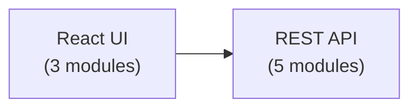
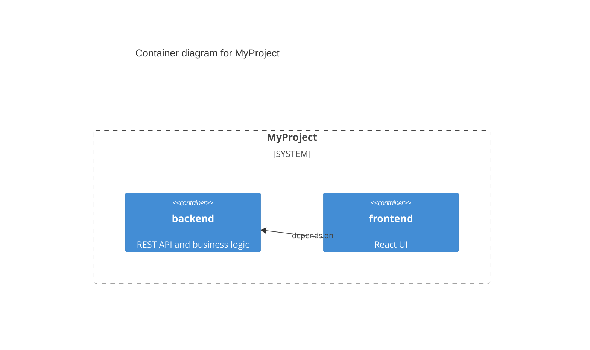

# arch

Architecture-as-code for any codebase. Define, query, and validate your project structure using `.arch` source files — designed for humans and AI agents alike.

## Why

AI coding agents are powerful but architecturally blind. They can write code, but they don't know where it belongs, what depends on what, or which boundaries to respect. `arch` gives any codebase a machine-readable architecture definition that agents read before making changes and update after.

For humans, it replaces scattered tribal knowledge with a queryable, version-controlled source of truth.

## Install

**Quick install (recommended):**

```bash
# Linux / macOS
curl -fsSL https://raw.githubusercontent.com/micsh/arch/main/install.sh | bash

# Windows (PowerShell)
irm https://raw.githubusercontent.com/micsh/arch/main/install.ps1 | iex
```

**Or build from source:**

```bash
cargo install arch
```

Pre-built binaries for all platforms are also available from [GitHub Releases](https://github.com/micsh/arch/releases).

## Quick Start

```bash
# In your project root — scaffold architecture from project structure
arch init

# Check everything is consistent
arch validate

# Who owns the "authentication" concept?
arch owns authentication

# Which source files aren't mapped to any module?
arch coverage

# Full health check (validate + coverage + drift)
arch stale

# Do actual imports match declared dependencies?
arch drift

# Do architectural rules hold against the real code?
arch fitness

# What are the dependency constraints on a module? (planning aid)
arch rules context

# Generate Mermaid container diagram
arch mermaid

# Any command with JSON output (for tooling / agent consumption)
arch drift --json
```

## What It Creates

```
your-project/
  architecture/
    arch/
      system.arch              # System map: containers, rules, stories, guidance
      containers/
        backend.arch           # Per-container module details
        frontend.arch
        ...
    llmcode/
      backend/
        auth.llm               # Per-module AI agent documentation
      ...
```

### `system.arch` — The Map

```
GUIDE:
Before making code changes, read the relevant container .arch file.
After changes, update ownership and dependencies if they changed.
ENDGUIDE

SYSTEM: MyProject
DESC: A web application with API and frontend
IGNORE: tests/**; **/*.test.ts; scripts/**

CONT: backend | src/backend | REST API and business logic
CONT: frontend | src/frontend | React UI | depends_on: backend

RULE: backend-independence | no_dependency | from: backend | to: frontend
  "Backend must not depend on frontend"

STORY: user-login | User submits credentials → validated → token issued → stored
  frontend/login-page → backend/auth → backend/database → backend/auth
```

### `containers/backend.arch` — The Details

```
MOD: auth | file: auth/mod.rs
OWN: authentication; token-validation; session-management
DEP: backend/database
BND: Auth logic only — no direct DB queries, use database module

MOD: database | file: db/mod.rs
OWN: connection-pool; migrations; query-execution
BND: Data access only — no business logic
```

### Grammar Reference

Run `arch spec --arch` to print the full `.arch` grammar reference in your terminal.
Run `arch spec --llmcode` to print the full `.llm` grammar reference.

## Commands

| Command | Description |
|---------|-------------|
| `arch init` | Scan project structure and generate initial `.arch` files |
| `arch init --deep` | Deep scan: infer modules from .csproj ProjectReference tags, Python packages |
| `arch validate` | Check integrity: files exist, cross-refs valid, schema correct |
| `arch coverage` | List source files not mapped to any module |
| `arch owns <concept>` | Find which module owns a concept, file, or module ID |
| `arch stale` | Full health check: validate + coverage + drift combined |
| `arch drift` | Compare declared dependencies against actual code imports |
| `arch fitness` | Validate architectural rules against actual code |
| `arch rules` | List all fitness rules from `system.arch` |
| `arch rules <module>` | Show what a module cannot depend on and what cannot depend on it |
| `arch stories` | Verify story flows against actual import connections |
| `arch context` | Print full architecture context as text (for AI agents) |
| `arch spec` | Show available grammar spec flags |
| `arch spec --arch` | Print full `.arch` grammar reference |
| `arch spec --llmcode` | Print full `.llm` grammar reference |
| `arch mermaid` | Generate Mermaid container dependency diagram |
| `arch mermaid --brief` | Generate diagram with IDs only (no descriptions) |
| `arch mermaid --stories` | Generate Mermaid flowcharts from story definitions |
| `arch mermaid --c4` | Generate C4 Container diagram |
| `arch mermaid --svg [FILE]` | Render to SVG (requires `mmdc`) |
| `arch mermaid --update-readme` | Inject diagram into README.md between markers |

All commands except `init`, `context`, `spec`, and `mermaid` support `--json` for structured output.

### `arch stale` — Full Health Check

Runs validate + coverage + drift in one pass — the single command for CI and pre-commit hooks:

```
$ arch stale
✅ Architecture is up to date (8 containers, all files mapped, no drift)
```

When issues are found, output is grouped by check:

```
[validate]
  ❌ Container 'auth': path 'src/auth' does not exist

[coverage]
  📂 src/utils/helpers.rs

[drift]
  ⚠️  backend/api (api/mod.rs:5)
      import: use crate::metrics → backend/metrics

⏰ 3 issue(s) found
```

Exit code 1 on validate errors or drift forbidden violations. Undeclared drift items are warnings (exit 0).

### `arch drift` — Dependency Drift Detection

Parses actual `import`/`open`/`use` statements from source files, resolves them to architecture modules, and compares against declared `depends_on` and `must_not_depend`:

```
$ arch drift
🚫 1 forbidden dependency violation(s):

  backend/database (db/mod.rs:3)
    import: use crate::auth → backend/auth

⚠️  2 undeclared dependency(ies):

  backend/api (api/mod.rs:5)
    import: use crate::shared → frontend/shared
  backend/api (api/mod.rs:8)
    import: use crate::metrics → backend/metrics

📊 12 modules scanned, 3 issue(s) found
```

Supports: F#, C#, Rust, TypeScript/JavaScript, Python, Go.

**Rust `pub use` re-export resolution:** When a Rust module re-exports types from a submodule via `pub use submodule::*` or `pub use submodule::Type`, `arch drift` recognises the re-export chain and resolves the import to the re-exporting facade module rather than producing a `[broad match]` false-positive. This means declaring a dependency on the facade (`mod.rs`) module is sufficient — you don't need to separately declare dependencies on every submodule it re-exports from.

### `arch fitness` — Rule Validation

Evaluates architecture rules from `system.arch` against the actual codebase:

```
$ arch fitness
✅ backend-independence
✅ database-leaf
❌ api-isolation — FAILED
    backend/api → frontend/shared (forbidden: backend → frontend)
📋 types-purity (manual check) No function implementations — only type definitions

📊 4 rule(s): 2 passed, 1 failed, 1 manual
```

- **`no_dependency` rules** are checked against the real import graph — violations are errors
- **`boundary` rules** are prose constraints reported as manual-check items

### `arch rules` — Rule Explorer

Lists fitness rules and explains the dependency constraints on any module. Designed as a planning aid — run this before assigning a shared utility to a module to avoid architecture violations at implementation time:

```
$ arch rules context
Rules applying to: context
  ❌ cannot depend on: commands, scanner, cli, imports
     context-independence — "Context is a shared loader — depends only on schema and resolve"

  ⚠️  other modules forbidden to depend on context:
     schema  (schema-independence — "Schema types are pure data — no logic dependencies")
     imports (imports-independence — "Import extraction is a pure leaf utility — ...")
     resolve (resolve-independence — "Resolution is a shared utility — ...")

$ arch rules          # list all rules
$ arch rules --json   # structured output
```

### `arch stories` — Flow Verification

Validates that story flows in `system.arch` are backed by real import connections between modules:

```
$ arch stories
📖 trading-cycle — One complete trading cycle: fetch market data and account state...
  app/orchestrator → app/data  ✅
  app/data → app/indicators  ✅
  app/indicators → app/awareness  ✅
  app/awareness → app/prompts  ✅
  app/prompts → app/ai  ✅
  app/ai → app/execution  ✅
  ✅ 6/6 connections verified

📊 3/3 stories fully connected
```

For each consecutive pair (A→B) in a flow, stories checks that A imports from B **or** B imports from A (bidirectional — handles event-driven and callback patterns). Same-project modules in compiled languages (.NET, Rust) are considered implicitly connected.

### Directory-Aware Coverage

When a module's `file:` points to a recognized entry point (`__init__.py`, `mod.rs`, `index.ts`, etc.) or a project file (`.csproj`, `.fsproj`, `.vbproj`), all source files in that directory tree are automatically covered by that module. This means you only need one module per package/directory — use `OWN:` for concepts, sub-modules for distinct boundary enforcement:

```
# Python: one module covers the entire models/ package and subpackages
MOD: models | file: models/__init__.py
OWN: market-snapshot; account-state; trade-decision; order-request
BND: Pure data structures only — no logic, no I/O
```

### .NET Monorepo Pattern

For .NET solutions, use one container per `.csproj` project. Point the module's `file:` at the `.csproj` — arch will recursively scan all `.cs`/`.fs` files in the project directory for imports:

```
# system.arch
CONT: data-processing | src/DataProcessing | Data pipeline and transformation | proj: MyApp.DataProcessing
CONT: common           | src/Common         | Shared utilities and types        | proj: MyApp.Common
```

```
# containers/data-processing.arch
MOD: app | file: DataProcessing.Application.csproj
OWN: pipeline-orchestration; data-transforms
DEP: common/shared
```

For containers with many sibling projects (e.g., `common/` with 30+ `.csproj` files), use `FILES:` to group multiple projects under one logical module:

```
# containers/common.arch
MOD: shared | file: Common.Utilities/Common.Utilities.csproj
FILES: Common.Extensions/Common.Extensions.csproj; Common.Helpers/Common.Helpers.csproj
OWN: utility-functions; extension-methods; helper-classes
BND: Shared utilities only — no business logic
```

### `arch mermaid` — Diagram Generation

Generates Mermaid diagrams from your architecture. Output is Mermaid text — paste into any Mermaid-compatible renderer (GitHub, VS Code, Mermaid Live Editor).

```bash
# Container-level dependency diagram with module subgraphs
arch mermaid

# Compact version with IDs only
arch mermaid --brief

# C4 Container diagram
arch mermaid --c4

# Story flow diagrams
arch mermaid --stories

# Render to SVG (requires @mermaid-js/mermaid-cli)
arch mermaid --svg                    # → architecture.svg
arch mermaid --svg diagram.svg        # → custom path
arch mermaid --c4 --svg               # C4 as SVG

# Auto-inject into README.md
arch mermaid --update-readme          # replaces content between markers
arch mermaid --c4 --update-readme     # C4 version
```

Container diagram example:


C4 Container diagram example:


#### SVG Export

Requires [`@mermaid-js/mermaid-cli`](https://github.com/mermaid-js/mermaid-cli):

```bash
npm i -g @mermaid-js/mermaid-cli
arch mermaid --svg
```

#### Auto-Update README

Add markers to your README.md where you want the diagram injected:

```markdown
<!-- arch:mermaid:start -->
<!-- arch:mermaid:end -->
```

Then run `arch mermaid --update-readme` (or combine with `--c4`). The diagram will be inserted as a fenced Mermaid code block between the markers. Useful in CI to keep documentation in sync.

### `--json` Output

All commands (except `init` and `mermaid`) support `--json` for structured output. Useful for CI pipelines, VS Code extensions, MCP servers, and agent tool integrations:

```bash
$ arch drift --json
{
  "scanned": 12,
  "issues": 1,
  "forbidden": [
    {
      "module_id": "backend/database",
      "file": "db/mod.rs",
      "import_raw": "use crate::auth",
      "line_number": 3,
      "target_module": "backend/auth",
      "kind": "forbidden"
    }
  ],
  "undeclared": []
}

$ arch owns authentication --json
{
  "query": "authentication",
  "matches": [
    {
      "module": "backend/auth",
      "file": "auth/mod.rs",
      "owns": "authentication",
      "boundary": "Auth logic only — no direct DB queries"
    }
  ]
}
```

## Choosing an enforcement model

arch has two enforcement mechanisms with different costs and trade-offs:

| Mechanism | Best for | Requires |
|-----------|----------|----------|
| `no_import_from` | Denylist: "these modules must not import X" | Only a naming convention |
| `Symmetric group isolation` | `no_dependency` rules, one per member — no container change |  |
| `restrict_callers_to` | Allowlist: "only these modules may import X" | Module in its own container |

> **Note:** when the peer group grows (e.g. a new command is added), the `no_dependency` ruleset must grow with it — one new rule per new member. This is the same maintenance cost as `no_import_from` in a peer-group context.

**Decision guide:**
1. **Correctness invariant** (a violation causes a bug, not just a style issue) → always use `restrict_callers_to` + own container
2. **Allowed set ≤ forbidden set** → prefer `restrict_callers_to` + own container
3. **Forbidden set < allowed set** → use `no_import_from`, no restructuring needed

**Container isolation rule:** a new container is warranted when the module IS a distinct architectural concept — not just to make the rule expressible. Ask: would this module warrant its own container even if arch didn't exist?

**Sub-module precision note:** `restrict_callers_to` operates at container level. If you need to restrict callers of a specific file within a shared container, isolate that file into its own container first.

> **Yield vs. codebase health:** the number of `restrict_callers_to` rules a codebase needs correlates inversely with its architectural health. A full audit that yields one or two rules is a good sign, not a failure of the tool. The rule type is most valuable in codebases with auth boundaries, payment gateways, audit trail write points, initialization-once patterns, or accumulated coupling. If your architecture is already clean, you may not need it beyond your most critical invariants.

## Ignoring Files

Use the `IGNORE:` field in `system.arch` to exclude files from `coverage` and `drift` checks. Patterns use glob syntax, separated by semicolons:

```
SYSTEM: MyProject
IGNORE: tests/**; **/*.test.ts; scripts/**; benchmarks/**
```

Ignored files won't be flagged as unmapped in `arch coverage` and won't be scanned for imports in `arch drift`.

## Designed for AI

The `GUIDE:`/`ENDGUIDE` block in `system.arch` provides instructions for AI agents working on the codebase. Teams can wire it into agent prompts however they like — the field is there as a convention. Typical guidance tells agents:

1. **Before coding** — read the relevant container `.arch` file for ownership and boundaries
2. **After coding** — update the `.arch` file if ownership or dependencies changed
3. **Cross-cutting changes** — check story flows in `system.arch` to understand impact

Use `arch context` to dump the full architecture as readable text — useful for injecting into agent context windows.

The `.arch` format is intentionally simple — no special query language, no database, no build step. Agents read `.arch` files directly, the same way they read code.

### For AI-powered teams

When multiple AI agents work on a codebase, `arch` provides:

- **Ownership routing** — which agent/coder owns which modules
- **Boundary enforcement** — what each module should and shouldn't do
- **Drift detection** — real-time validation that code matches the architecture
- **Impact analysis** — stories show which modules a change affects
- **Grammar specs** — run `arch spec --arch` or `arch spec --llmcode` to get full grammar references for agents that need to read or write `.arch`/`.llm` files

## CI / Git Hooks

### GitHub Actions

Add architecture validation to your PR pipeline. Copy `examples/arch-ci.yml` to `.github/workflows/` or use this snippet:

```yaml
# .github/workflows/arch-ci.yml
name: Architecture Check
on:
  pull_request:
    branches: [main]
jobs:
  arch:
    runs-on: ubuntu-latest
    steps:
      - uses: actions/checkout@v4
      - name: Download arch
        run: |
          curl -sL "https://github.com/micsh/arch/releases/latest/download/arch-linux-x64" -o arch
          chmod +x arch
      - run: ./arch validate
      - run: ./arch drift
      - run: ./arch fitness
```

### Pre-commit Hook

Validate architecture before every commit. Copy the hook from `examples/pre-commit`:

```bash
cp examples/pre-commit .git/hooks/pre-commit
chmod +x .git/hooks/pre-commit
```

The hook runs `arch validate` and `arch drift`, blocking the commit if violations are found. Skip temporarily with `git commit --no-verify`.

## `.arch` File Format Reference

Architecture is declared in plain-text `.arch` files. Run `arch spec --arch` for the full grammar reference.

### `system.arch` — Top-Level Keywords

| Keyword | Description |
|---------|-------------|
| `GUIDE:` / `ENDGUIDE` | Multi-line agent guidance block |
| `SYSTEM: <name>` | Project name |
| `DESC: <text>` | System description |
| `IGNORE: <glob>; <glob>` | Glob patterns to exclude from coverage and drift |
| `CONT: <id> \| <path> \| <desc>` | Declare a container |
| `RULE: <id> \| <type> \| <fields...>` | Declare a fitness rule |
| `STORY: <id> \| <description>` | Declare a story (followed by flow lines `A → B`) |

### Container `.arch` — Module Keywords

| Keyword | Description |
|---------|-------------|
| `MOD: <id> \| file: <path>` | Module entry point |
| `FILES: <path>; <path>` | Additional files covered by this module |
| `OWN: <concept>; <concept>` | Concepts this module owns |
| `BND: <text>` | Boundary constraint (what this module should NOT do) |
| `DEP: <container/module>; ...` | Declared dependencies |
| `NDEP: <container/module>; ...` | Explicit forbidden dependencies |
| `MODULE: <id>` | Protected module for `restrict_callers_to` rules |

### Rule Types

| Type | Fields | Description |
|------|--------|-------------|
| `no_dependency` | `from:`, `to:` | Forbids dependency between modules/containers |
| `no_import_from` | `from:`, `pattern:` | Forbids imports matching a glob pattern |
| `boundary` | `module:`/`modules:`, `constraint:` | Enforces a prose constraint on what a module can do |
| `restrict_callers_to` | `module:`, `to:` | Allowlist: only listed modules may import the protected module |

Example rule declaration:

```
RULE: no-test-imports | no_import_from | from: mypackage | pattern: tests*
  Production code must not import from test modules
```

### Story Fields

Stories are declared in `system.arch` as:

```
STORY: user-login | User submits credentials → validated → token issued
  frontend/login-page → backend/auth → backend/database
```

Each line after the `STORY:` header is a flow step. `→` separates consecutive module pairs to verify.

### System Fields

| Field | Required | Description |
|-------|----------|-------------|
| `SYSTEM:` | ✅ | Project name |
| `DESC:` | | What this system does |
| `IGNORE:` | | Semicolon-separated glob patterns for files to exclude |

### Container Fields

| Field | Required | Description |
|-------|----------|-------------|
| `id` (first segment of `CONT:`) | ✅ | Unique container identifier |
| `path` (second segment) | ✅ | Relative path to source directory |
| `desc` (third segment) | ✅ | What this container does |
| `depends_on:` | | Semicolon-separated list of container IDs this depends on |
| `proj:` | | Build system project name (e.g., crate, package, assembly) |

### Module Fields

| Field | Required | Description |
|-------|----------|-------------|
| `MOD:` | ✅ | Module id and entry-point file |
| `FILES:` | | Additional files covered by this module |
| `OWN:` | ✅ | Semicolon-separated list of concepts this module owns |
| `BND:` | | What this module should NOT do |
| `DEP:` | | Semicolon-separated `container/module` dependencies |
| `NDEP:` | | Semicolon-separated forbidden dependencies |

## Language Support

`arch drift` parses imports and `arch init` detects project type for these languages:

| Language | Detection | Import syntax |
|----------|-----------|---------------|
| Rust | `Cargo.toml` | `use crate::`, `mod`, `use super::` |
| F# | `*.fsproj` | `open Namespace.Module` |
| C# | `*.csproj` | `using Namespace;` |
| TypeScript/JS | `package.json` | `import ... from '...'`, `require('...')` |
| Python | `pyproject.toml`, `setup.py` | `import module`, `from module import ...` |
| Go | `go.mod` | `import "package"` |

## Contributing

Contributions welcome! Open an issue or submit a pull request.

## License

MIT
